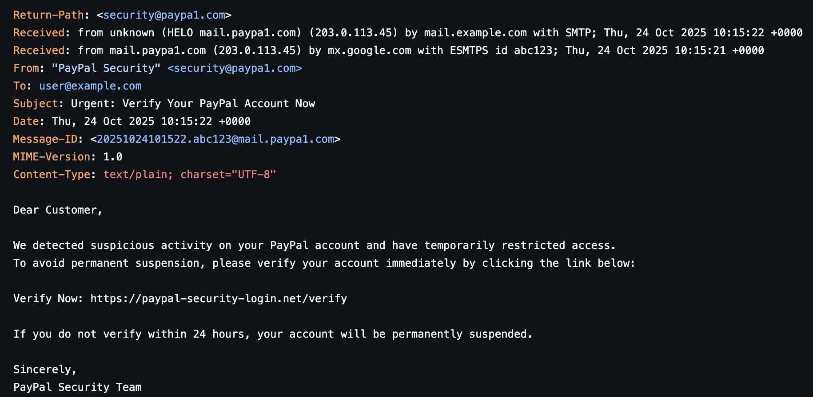
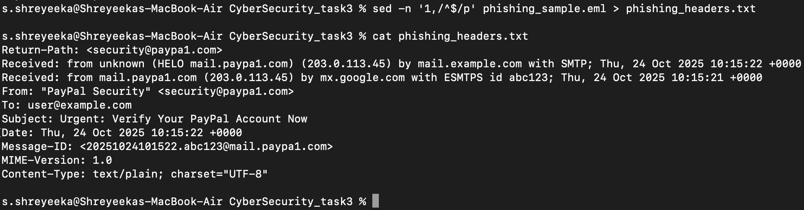
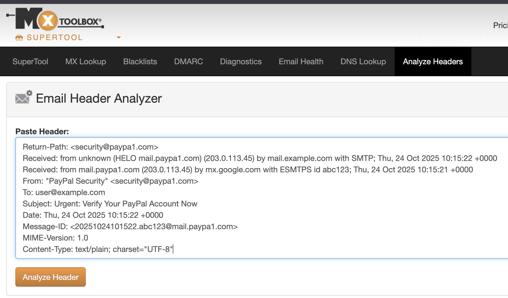
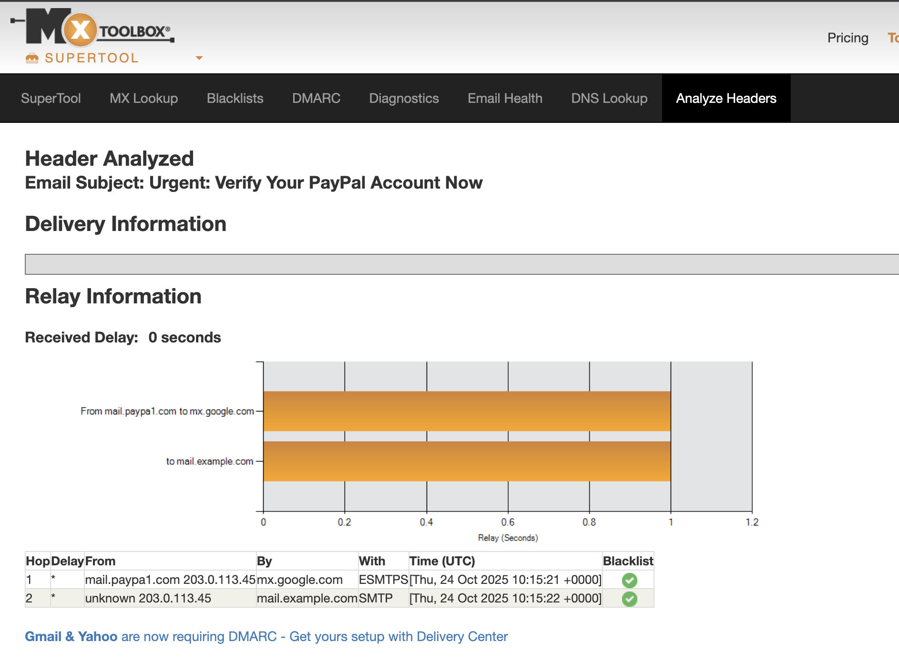
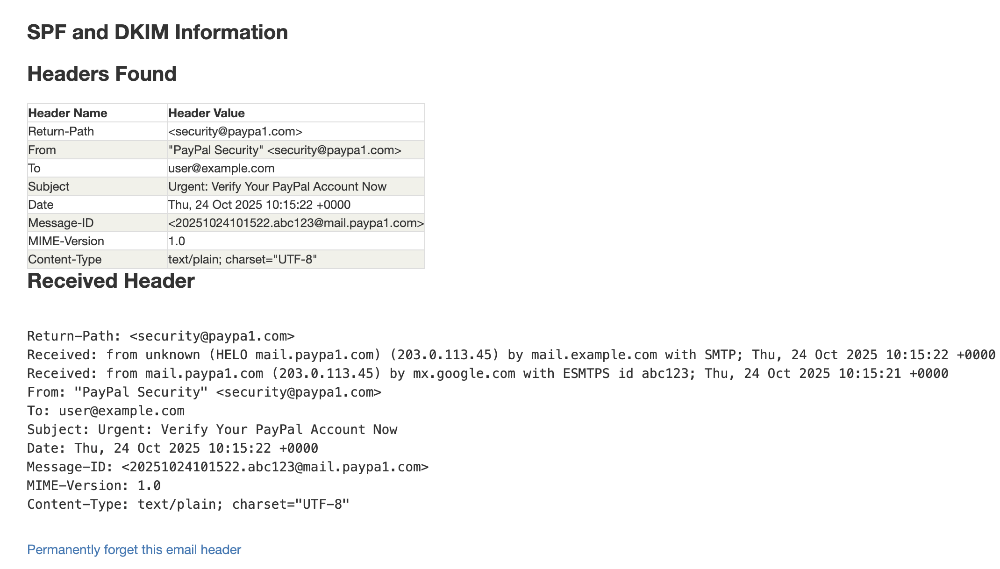

# Task 3: Analyze a Phishing Email Sample

## Objective:
Identify phishing characteristics in a suspicious email sample

## Tools:
- **Email client or saved email file (text)**
- **Free online header analyzer (e.g. [MX toolbox](https://mxtoolbox.com/EmailHeaders.aspx))**

## Guide
1. Obtain a sample phishing email (many free samples online)
2. Examine sender's email address for spoofing
3. Check email headers for discrepancies (using online header analyzer)
4. Identify suspicious links or attachments
5. Look for urgent or threatening language in the email body
6. Note any mismatched URLs (hover to see real link)
7. Verify presence of spelling or grammar errors
8. Summarize phishing traits found in the email

---

## Sample Email
- **File: [phishing_sample.eml](phishing_sample.eml)**

---

## Executive summary
This report analyzes a synthetic phishing email sample (phishing_sample.eml) created for training. The message simulates a PayPal-themed credential phishing attempt and exhibits multiple classic phishing indicators: spoofed sending domain, suspicious hosting IP, urgent/pressure language, and a mismatched suspicious link

---

## Raw header (extracted)
- **To extract headers, in my case (macOS), the mentioned command is used:**
    - sed -n '1,/^$/p' phishing_sample.eml > phishing_headers.txt
    - cat phishing_headers.txt 

 

---

## Header Analysis
1. Open [MXToolbox](https://mxtoolbox.com/EmailHeaders.aspx).
2. Inside email header analyzer, paste the contents of [phishing_headers.txt](phishing_headers.txt) (or the header block) into the box.
3. Click Analyze Header.

4. Analyzed Reports:

- <h3>Results:</h3>
1. Sender: "PayPal Security" <security@paypa1.com> i.e, spoofed domain (paypa1.com instead of paypal.com)
2. Return-Path: <security@paypa1.com> — matches the spoofed sender, confirming fake origin
3. Received hops:
   - mail.paypa1.com (203.0.113.45) → mx.google.com
   - unknown (203.0.113.45) → mail.example.com
   - Shows message routed through an unrecognized external server, not PayPal’s network
4. Relay delay: 0 seconds. This indicates immediate transfer, typical in synthetic or automated spam/phishing emails
5. Origin IP: 203.0.113.45 — not part of PayPal’s legitimate IP range; likely forged
6. Blacklist check: Passed (no blacklist entries), but that doesn’t prove legitimacy (phishing emails often use new or clean domains)
7. SPF/DKIM/DMARC: Missing — no authentication detected in the header
8. Message-ID: <20251024101522.abc123@mail.paypa1.com> — generated from the spoofed domain

---

## Findings/Summary:
1. <h3>Header-Level Findings:</h3>
- **Spoofed sender domain:- From: security@paypa1.com → uses “1” instead of “l” to imitate PayPal**
- **Return-Path mismatch: Domain doesn’t match legitimate PayPal servers**
- **Origin IP: 203.0.113.45 — unrelated to PayPal infrastructure**
- **Missing SPF/DKIM/DMARC: No authentication found, typical of forged emails**
- **Message-ID anomaly: Message ID created under the spoofed domain**

2. <h3>Body-Level Findings:</h3>
   - **Urgent / threatening tone: “Verify within 24 hours” → pressure tactic**
   - **Generic greeting: “Dear Customer” instead of recipient’s real name**
   - **Suspicious link: https://paypal-security-login.net/verify → fake domain pretending to be PayPal**
   - **Mismatched link text: “Verify Now” hides a malicious URL**
   - **Minor grammar issues: Slightly awkward phrasing common in phishing messages**
   - **Lack of personalization: No mention of account details or user identity**

---

## Outcome:
Awareness of phishing tactics and email threat analysis skills.